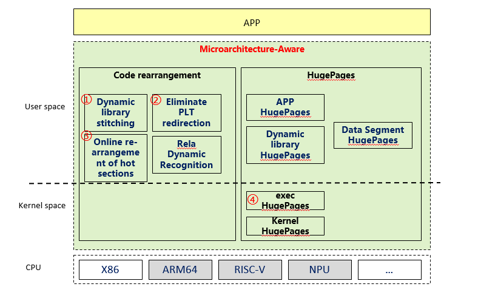

# sysboost

#### Description
Sysboost converts dynamic links into static links by combining executable files and dynamic library files. This reduces the overhead and delay of dynamic links and improves the execution efficiency of programs.

#### Software Architecture

Microarchitecture-Aware

Dynamic library stitching
In the ld loading phase, code segments of scattered dynamic libraries are combined and aggregated, and huge page memory is used to improve the iTLB hit ratio.

exec HugePages
The user-mode hugepages mechanism requires application configuration modification and recompilation. The exec native hugepage mechanism directly uses hugepage memory in the ELF file loading phase, which is transparent to apps.

Eliminate PLT redirection
In the process of invoking dynamic library functions, the application code needs to jump to the PLT table and then to the real function. Eliminating the PLT jump can improve the IPC.

Online re-arrangement of hot sections
By default, code snippets are arranged based on the dynamic library granularity. Hot code can be rearranged based on the section granularity using the online rearrangement technology.
#### Installation
For details, see the sysBoost section in openEuler/docs.

#### Instructions
For details, see the sysBoost section in openEuler/docs.

#### Contribution
1. If bugs are found or new requirements are required, submit issue; https://gitee.com/openeuler/sysboost/issues.
2. Submit the patch for fixing bugs or new features through Pull Request.
