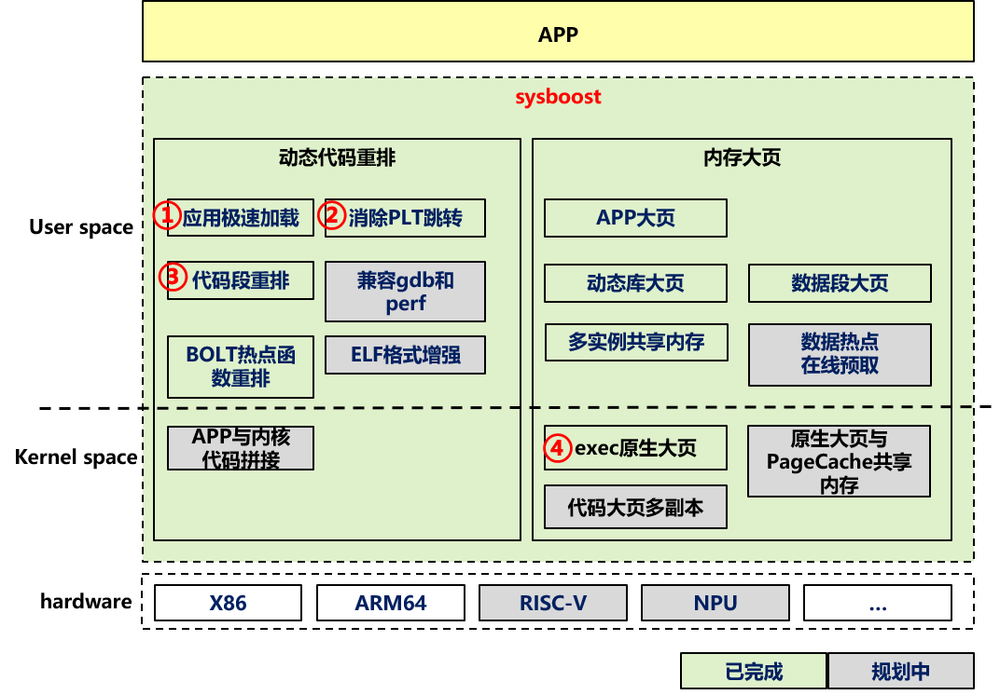

# sysboost

#### 介绍

通过sysboost代码重排技术对可执行文件和动态库文件在线重排操作，优化代码与运行环境的CPU微架构的适应性, 提升程序性能。该技术在保证程序语义和意图不变的情况下, 优化汇编指令, 代码布局, 数据布局, 内存大页, 系统调用等。

#### 软件架构

微架构优化技术

动态库拼接
通过ld加载阶段将分散的动态库的代码段数据段拼接聚合，然后使用大页内存提升iTLB命中率。

exec原生大页
用户态大页机制需要应用修改配置和重编译，exec原生大页机制直接在内核加载ELF文件阶段使用大页内存，对APP透明。

消除PLT跳转
应用代码调用动态库函数的流程，需要先跳转PLT表，然后跳转真实函数，消除PLT跳转能提升IPC。

热点Section在线重排
默认情况下代码段是按动态库粒度排布的，通过在线重排技术可以实现热点代码按Section粒度重排。

#### 构建/安装教程

请参考openEuler/docs下sysBoost章节;

#### 使用说明

请参考openEuler/docs下sysBoost章节;

#### 参与贡献

1.  发现BUG或者有新需求请提issue;  https://gitee.com/openeuler/sysboost/issues
2.  修复BUG或者新特性的补丁请通过Pull Request提交; 